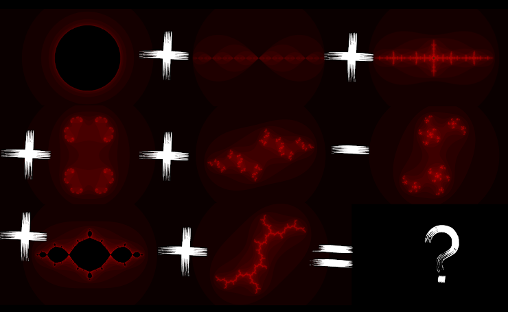

$Header()$

<h1>Enigma 2021: Finals</h1>

<h2>Rules</h2>
<ol>
<li> May the duck / 10^100 / Utube guide you with your searches.
<li> We like apples and penguins but sometimes we prefer throwing them out of the window.
<li> We never went on a safari or tamed a red panda or been to an opera . We’re currently battling with the multicolored ‘monster’ disk and would recommend the same if the others ditch you.
<li> No Hermione, it’s neither LeviOsa, nor LevioSA. It’s ‘wingardiumleviosa’ plain and simple. No caps. No space.
<li> Paper and quills will help.
<li> Sometimes you need to download some plushy softwares.
<li> Order of court can be ignored but one shall not ignore the order of questions.
<li> Thou shall be ranked by your intellectual potential to score marks and submit fast. (No ranking of kings here everyone is a winner!)
<li> Thou shalt doubt our intellect by wondering how many answers a question has. Just like god there is only one true answer and that's ours.
<li> Thou shall submit on or before 8 pm. (Not anymore!😀)
<li> Only ONE submission per team. (Again, Not anymore!😀)
<li> Read the rules AGAIN
</ol>

<h2>Still confused?</h2>
<ol>
<li>Suggested search engines include DuckDuckGo, Google, Youtube.
<li>Although almost all software could be used by all operating systems, questions were tested only on Windows. And thus is the recommended OS.
<li>Questions were tested out using the Chrome Browser.
<li>Answer should be all small. No Caps. No spaces.
<li>USE your search engines!
<li>It’s advised to use pen and paper to solve ciphers.
<li>The quiz requires you to download some software. Hope you download them in time.
<li>It’s advised to solved questions in a section in the same order as they are put up.
<li>Teams will be ranked based on their marks and time of submission. (No ranking of kings here everyone is a winner!)
<li>There is only one answer to every question.
<li>Submissions close at 8 pm sharp.(Not anymore!😀)
<li>Read the rules again.
</ol>

$hr()$

<h2>Questions</h2>
$hr()$

<h3>Section 1</h3>
$hr()$

A beautifully complex equation in 1.5236270862 dimensions

Play with multiples of 0.5

<input class="EnigmaAnswer"></input>
<button type=button onclick="CheckEnigmaAnswer()" class="EnigmaAnswerButton">Verify!</button>

$hr()$

$Footer()$
